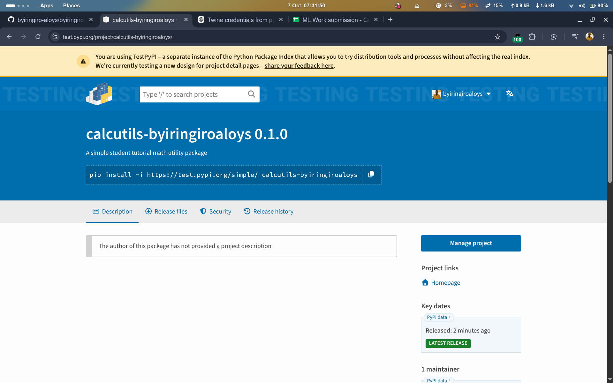
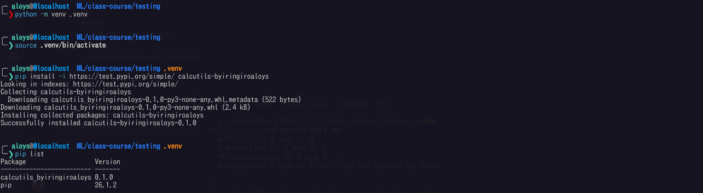
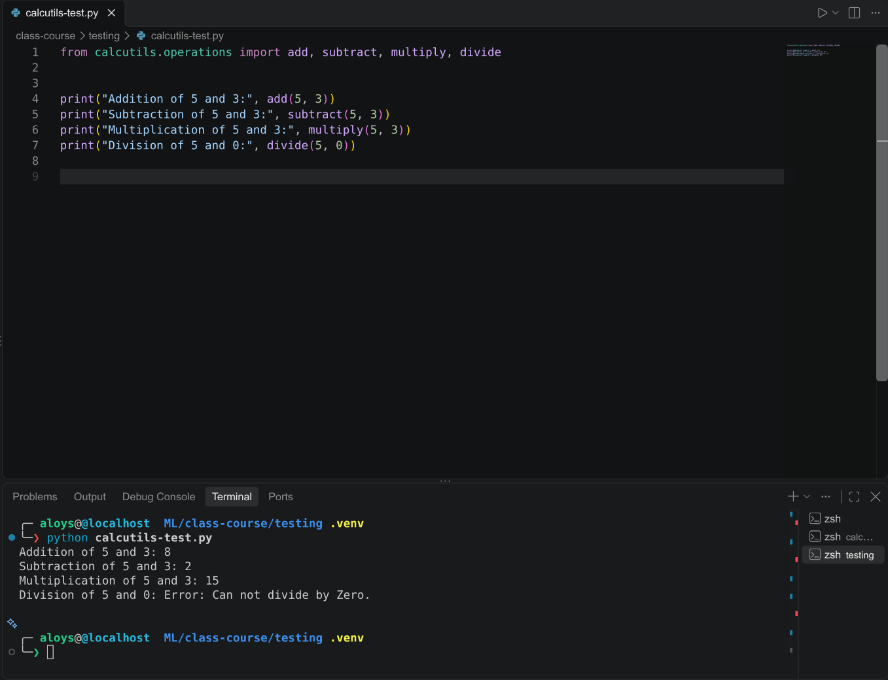

# calcutils-byiringiroaloys

A simple Python math utility package providing basic arithmetic and statistical helper functions.

**Version:** 0.1.0  
**Author:** Aloys Byiringiro  
**License:** MIT

---

## Package on TestPyPI



---

## Installation

Install from TestPyPI using pip:

```bash
pip install -i https://test.pypi.org/simple/ calcutils-byiringiroaloys
```



---

## Usage

> **Note:** The install name is `calcutils-byiringiroaloys` but you import from `calcutils.operations`.

All functions are available via `calcutils.operations`:

```python
from calcutils.operations import add, subtract, multiply, divide, average
```

---

## Functions

### `add(num1, num2)`
Returns the sum of two numbers.

```python
from calcutils.operations import add

print(add(5, 3))  # 8
```

### `subtract(big_num1, small_num2)`
Returns the difference between two numbers.

```python
from calcutils.operations import subtract

print(subtract(5, 3))  # 2
```

### `multiply(num1, num2)`
Returns the product of two numbers.

```python
from calcutils.operations import multiply

print(multiply(5, 3))  # 15
```

### `divide(num1, num2)`
Returns the result of dividing `num1` by `num2`.  
Returns an error string if `num2` is zero — does **not** raise an exception.

```python
from calcutils.operations import divide

print(divide(10, 2))  # 5.0
print(divide(5, 0))   # Error: Can not divide by Zero.
```

### `average(numbers)`
Returns the arithmetic mean of a list of numbers. Returns `0.0` for an empty list.

```python
from calcutils.operations import average

print(average([1, 2, 3, 4, 5]))  # 3.0
print(average([]))               # 0.0
```

---

## Example

```python
from calcutils.operations import add, subtract, multiply, divide

print("Addition of 5 and 3:", add(5, 3))
print("Subtraction of 5 and 3:", subtract(5, 3))
print("Multiplication of 5 and 3:", multiply(5, 3))
print("Division of 5 and 0:", divide(5, 0))
```



---

## Links

- [TestPyPI](https://test.pypi.org/project/calcutils-byiringiroaloys/)
- [GitHub](https://github.com/byiringiro-aloys/byiringiroaloys-calcutils)
